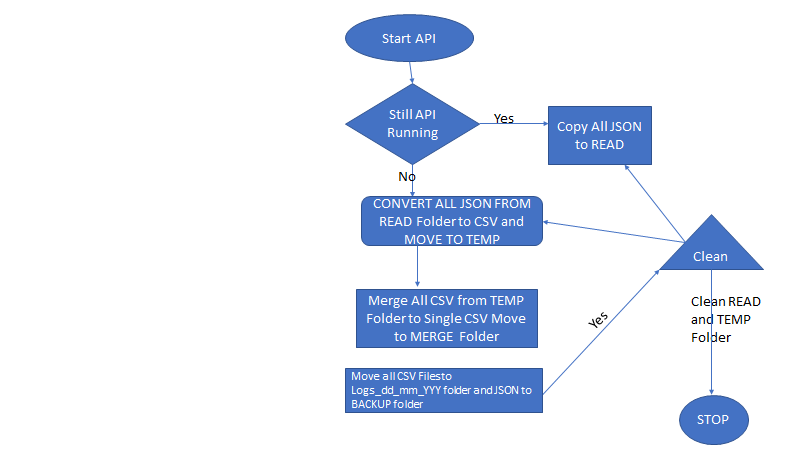

# AzureAD Sign-In Logs

## Utility Usage

This utility is used to fetch AzureAD sign-in logs in Json format and then convert it into CSV format.

Below are the steps to be followed before executing the script

1. Create an application of type Web App in Azure AD. Make a note of its Client ID and Client Secret. These values need to be updated in Signins_API.ps1.
2. Grant your application the permission to use the API.
3. Replace {Path_to_dir} in the scripts to the corresponding directory location in both the scripts (Signins_API.ps1 and ConvertToCSV.ps1)
4. Update $tenantDomain and $TenantGUID with the respective Tenant details in Signins_API.ps1

Following are the folders that need to be created before script execution

1. READ - Temporary folder which stores JSON response from Azure API sign-in Logs . This folder contains one complete run sign on logs in JSON files.
   Logs_dd_mm_yyyy folder-This folder contains all csv formatted sign-in logs. Basically this backup sign-in files
2. TEMP - All JSON Files under READ folder gets converted into csv and moved this folder
3. MERGED - All CSV files which are present in TEMP files will get merged to single and moved to this folder
4. BACKUP - All csv and JSON files get moved to this folder

## Flow Diagram

## Script Execution

Execute the script **MasterRunner.ps1**

