# OktaCreateUserAPI
## Utility Usage
This utility is built as an API with Lambda integration using API gateway. It contains validation of the provided token using authorizer. The main functionality of this utility is to create user in a provided Okta tenant. 
## Initial Setup
* Install Java 8 on the machine
* Install Eclipse (use the latest version)
* Import the project as Maven project
* Build the jar using maven build
## Lambda Function
1. Login to AWS console. Create a new Lambda function as specified in the screenshot below. For execution role, we can either create a new role or use an existing role. 
Note: Refer to https://docs.aws.amazon.com/lambda/latest/dg/getting-started-create-function.html for detailed steps on creating new Lambda function
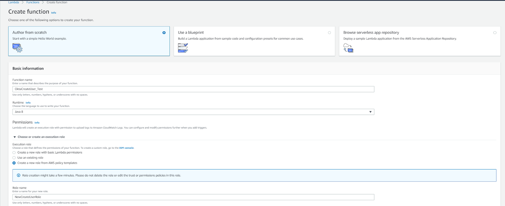
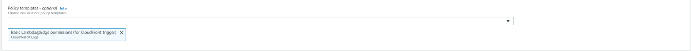

2. Upload the jar by performing below steps :
    - Select ‘Upload a .zip or .jar file’ option under Code entry type. Under the Function package click on Upload and select the jar file
    - Select Runtime as ‘Java 8’ 
    - Provide the Handler information as the complete package structure of the LambdaFunctionHandler as below:
        com.lambda.okta.restapi.LambdaFunctionHandler::handleRequest
 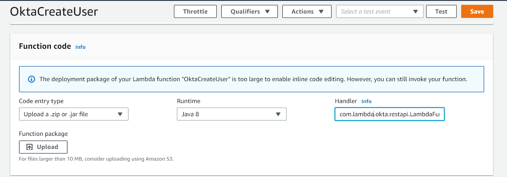

3. To add environment variables :
    - Under environment variables, click on ‘Manage environment variables’. Then click on ‘Add environment variable’. 
    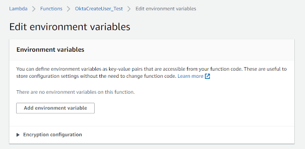

    - Add the following environment variables
        - ApiUrl – Okta api url (https://{url}/api/v1/users/{UserLogin} , here url is Okta tenant url)
        - Audience – Recipient that the JWT is intended for
        - Issuer_URL – Used to verify the Okta token provided (https://{url}/oauth2/default, here url is Okta tenant url)
     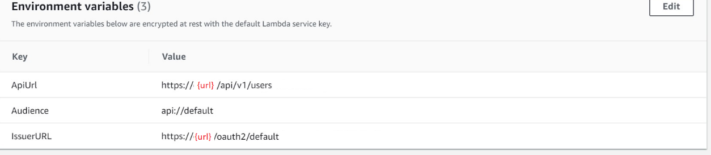
     
## API Gateway
  1. Create a new API by providing below details
      - Login to AWS console, select API Gateway under Services
        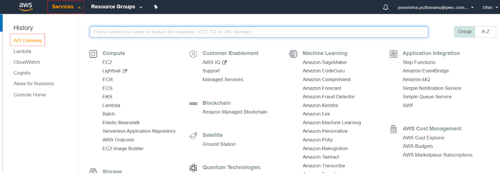
        
      - Click on ‘Create API’
        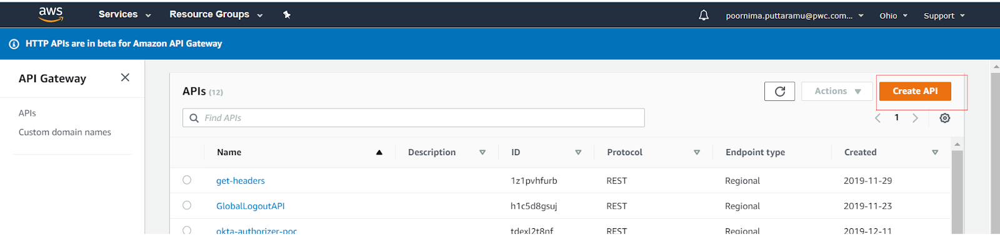
        
      - Click on Build option under ‘REST API’
        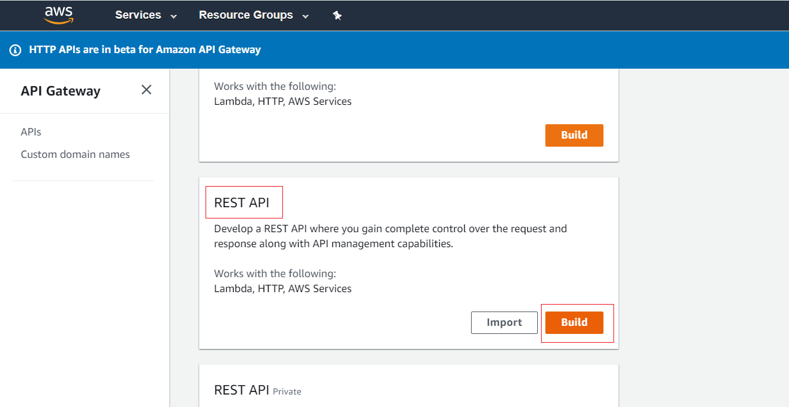
      
      - Provide API name, Description and Endpoint Type and click on ‘Create API’. In our case we provide Endpoint Type as Regional. 
        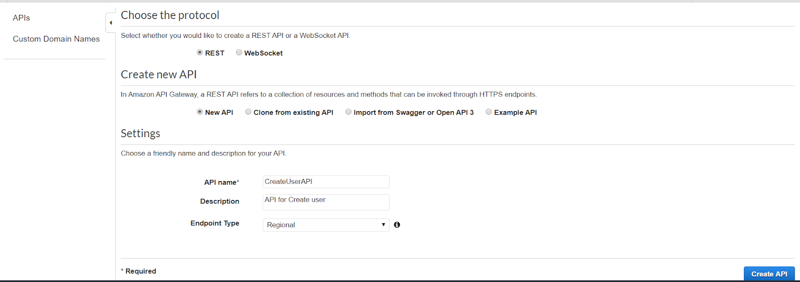
        `Note: Regional APIs are deployed in current region, Edge Optimized APIs are deployed to the CloudFront network and Private APIs are accessible only from VPCs`
  2. Create Resource and Method for the API
      - Click on Actions and select ‘Create Resource’
        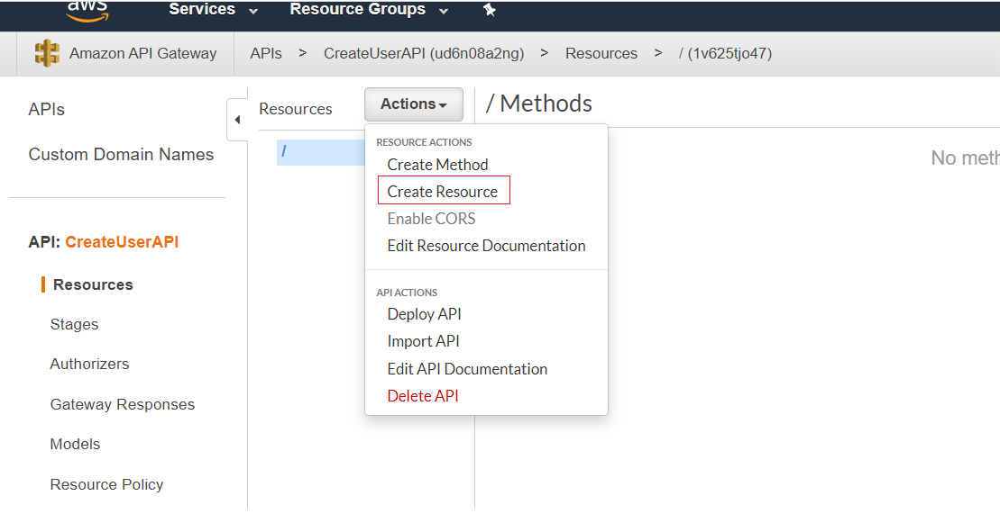
        
      - Provide Resource Name and click on ‘Create Resource’
        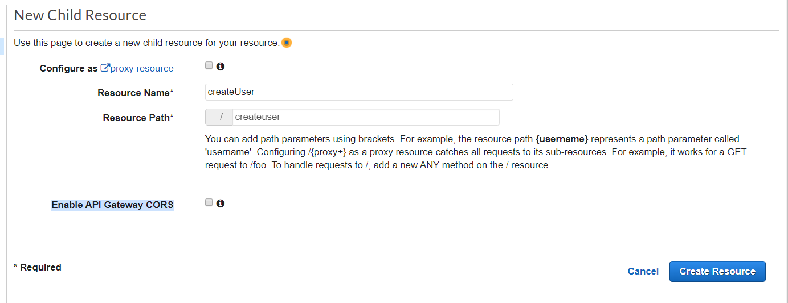
        
      - Click on Actions and select ‘Create Method’
        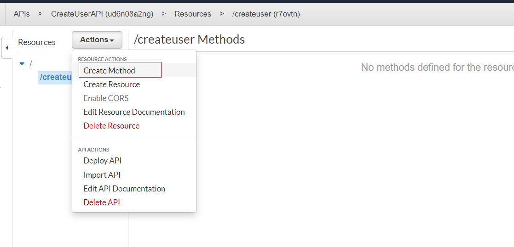

      - Select Post and click on ‘✓’
        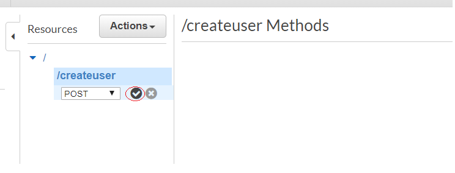
        
      - Select ‘Lambda function’ as Integration type, select the appropriate Lambda region. Provide the name of the Lambda function created in section ‘Lambda Function’ and click on Save
        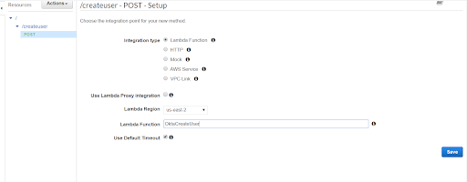
        
      - Click on ‘Ok’ in the pop up box
        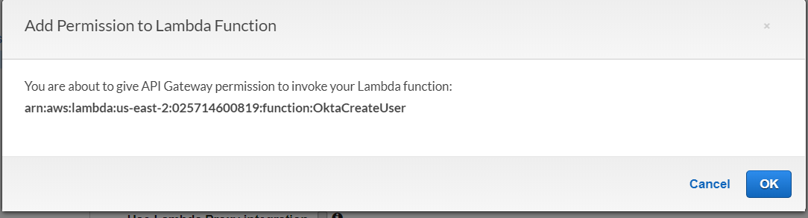
        
      - Click on ‘Integration Request’
        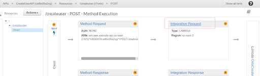

          - Under Mapping templates, select ‘When there are no templates defined (recommended)’ radio button for Request body passthrough. Click on ‘Add mapping template’ and give value as ‘application/json’ and click on ‘✓’.
            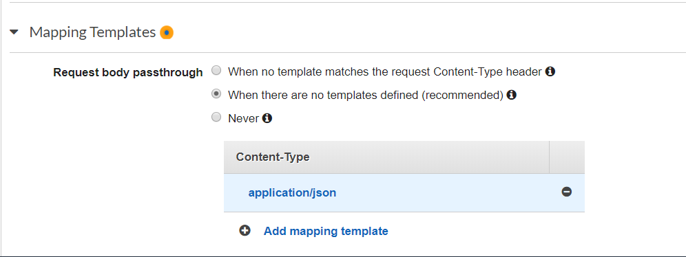
            

          - Add below lines under the ‘Generate template’ box and click on Save.
          `Note: The below template will pass through all parameters including path, querystring, header, stage variables, and context through to the integration endpoint via the body/payload`
         ``` 
            #set($allParams = $input.params())            
            {            
              "body-json" : $input.json('$'),              
              "params" : {              
              #foreach($type in $allParams.keySet())              
                  #set($params = $allParams.get($type))                  
              "$type" : {              
                  #foreach($paramName in $params.keySet())                  
                  "$paramName" : "$util.escapeJavaScript($params.get($paramName))"                  
                      #if($foreach.hasNext),#end                      
                  #end                  
              }             
                  #if($foreach.hasNext),#end                  
              #end              
              },              
              "stage-variables" : {              
              #foreach($key in $stageVariables.keySet())              
              "$key" : "$util.escapeJavaScript($stageVariables.get($key))"              
                  #if($foreach.hasNext),#end                  
              #end              
              },              
              "context" : {
                  "account-id" : "$context.identity.accountId",
                  "api-id" : "$context.apiId",
                  "api-key" : "$context.identity.apiKey",
                  "authorizer-principal-id" : "$context.authorizer.principalId",
                  "caller" : "$context.identity.caller",
                  "cognito-authentication-provider" : "$context.identity.cognitoAuthenticationProvider",                  
                  "cognito-authentication-type" : "$context.identity.cognitoAuthenticationType",                  
                  "cognito-identity-id" : "$context.identity.cognitoIdentityId",                  
                  "cognito-identity-pool-id" : "$context.identity.cognitoIdentityPoolId",                  
                  "http-method" : "$context.httpMethod",                  
                  "stage" : "$context.stage",                  
                  "source-ip" : "$context.identity.sourceIp",                  
                  "user" : "$context.identity.user",                  
                  "user-agent" : "$context.identity.userAgent",                  
                  "user-arn" : "$context.identity.userArn",                  
                  "request-id" : "$context.requestId",                  
                  "resource-id" : "$context.resourceId",
                  "resource-path" : "$context.resourcePath"
                  }
              }
             

  3. Deploying the API
      - Click on Actions and select ‘Deploy API’
        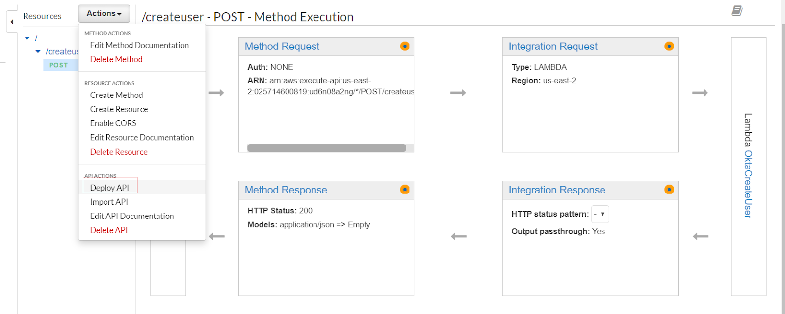
        
      - Select Deployment stage. If we are deploying the API for the first time, we need to create a new stage. Provide Stage name, Stage description and Deployment description. Click on ‘Deploy’
        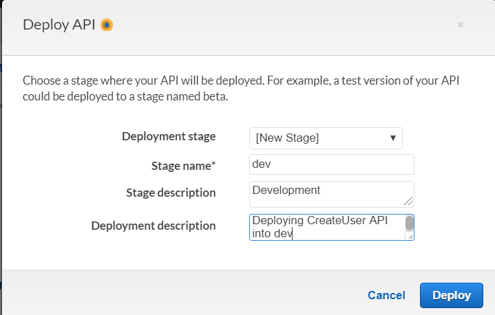

      - When we click on Post under Stage ‘dev’, we will be able to get the Invoke Url (API Url)
        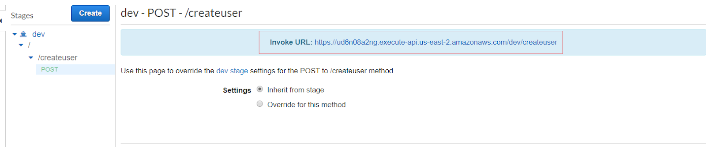
        

## Invoking the API 
  
  1. We invoke the API through Postman. Click on a new request, select Post and in the url specify the API url obtained in the previous step
  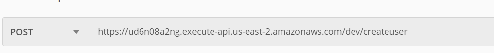

  2. Provide the following under ‘Headers’ 
      - Authorization – Token used for performing the operations on Okta
      - TokenType – Whether the token provided is ‘Admin’ or ‘Bearer’
      - Accept – Accepted input type. Ex: application/json
  3. Provide the JSON input under ‘Body’. This Json input will contain all the attributes for user creation
  4. Click on Send to call the API. 
