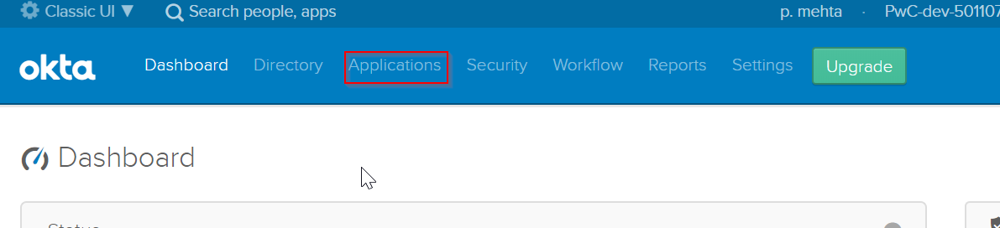
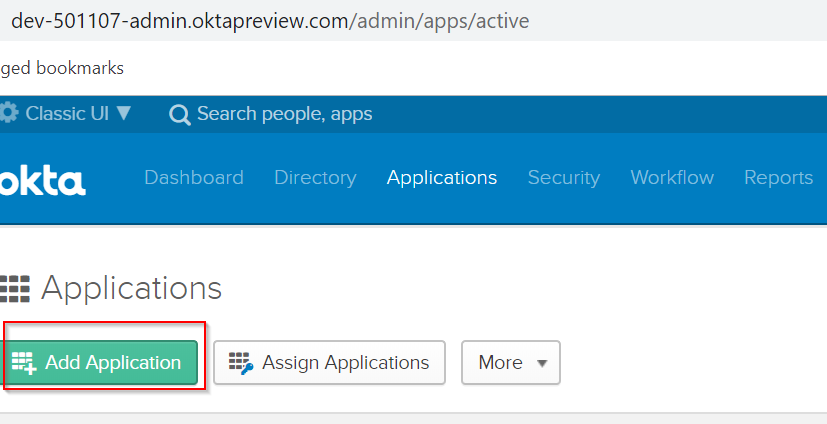
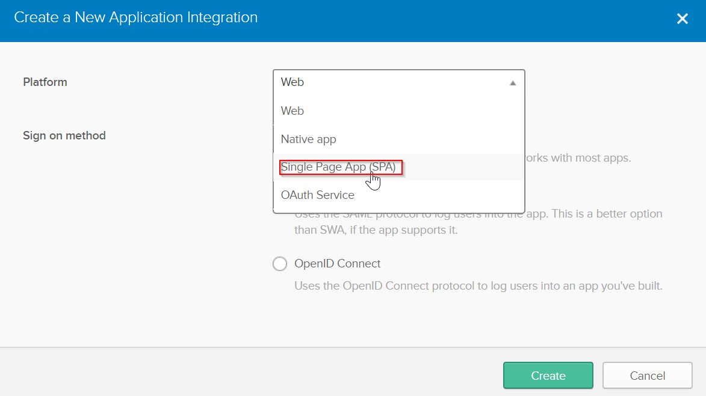
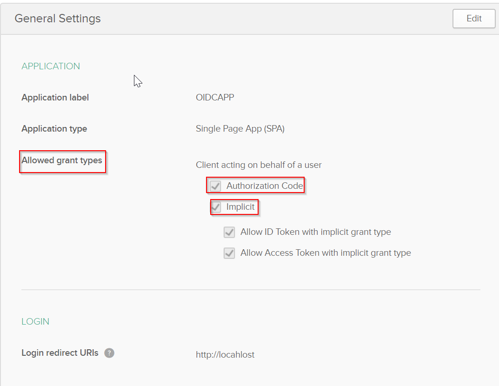
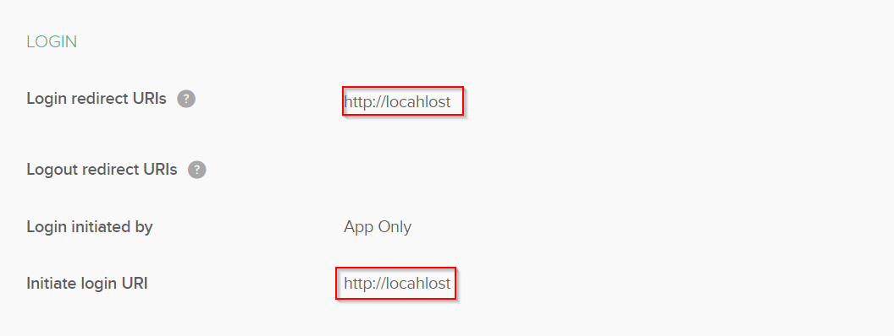
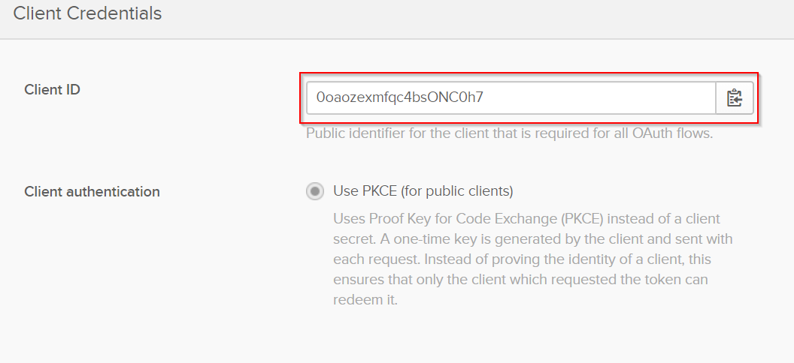
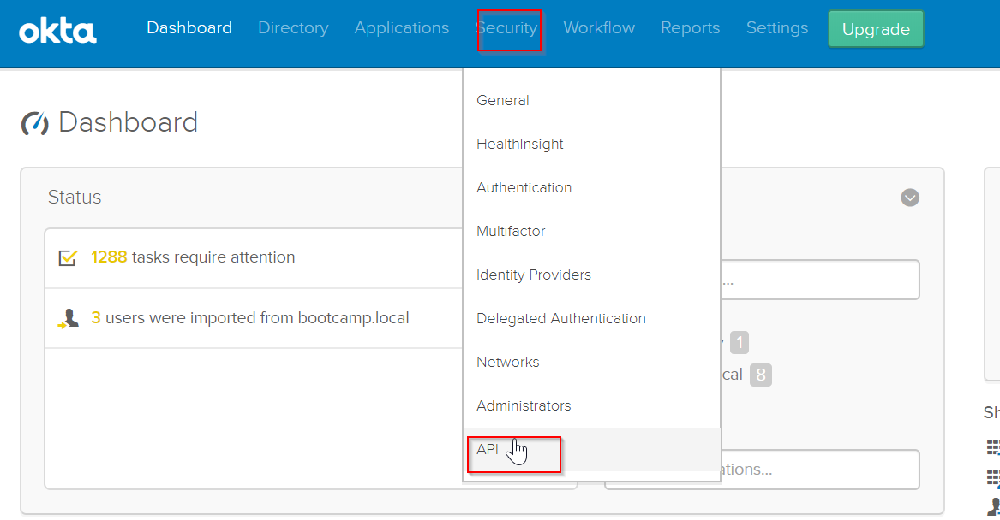
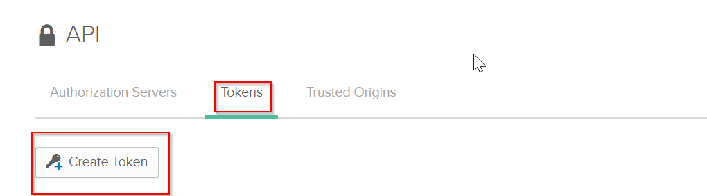
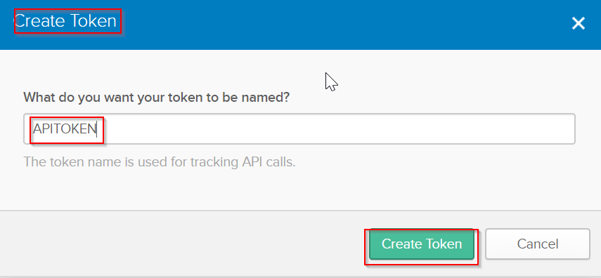

# SLO Utility

## AWS Resource Details
The below table contains the details of the AWS resources involved in SLO module.
These resources needs to exported as CFT templates and migrated to the other environment(s).
| AWS Resources | Name of the Resources |
| ------------- | --------------------- |
| DynamoDB      | <ul><li>Application_Details</li><li>OktaDetails</li></ul> |
| Elastic Beanstalk | CustomLogoutApp |
| SecretsManager | OKTA_DEV_TOKEN  (The name can be changed as per the environment) |
| IAM Roles | <ul><li>access_secret_manager_role</li><li>aws-elasticbeanstalk-ec2-role</li><li>aws-elasticbeanstalk-service-role</li><li>AWSServiceRoleForAutoScaling</li><li>AWSServiceRoleForElasticLoadBalancing</li></ul> |

## OpenID setup in Okta
A “dummy” Single Page OpenID application has to be created in Okta.Set up an Open ID Application in by choosing the platform as “Single Page App”

By creating this application in Okta, we will use this application’s Client ID which is needed to determine userid of current user’s session.
Okta JS library provides the logic to do the sign in process and get the current user’s session and this needs a Client ID of an application configured in Okta..
Using current user’s session, we can determine userid from Okta for current user session and use i in further processing with SysLogs API to get all applications user has signed into.

### Detailed Steps to the above task

1. Log into Okta as an Administrator
2. Click on the Applications tab in the Okta Dashboard
  
3. Click on Add Application. Select new application
  
4. Select application type/platform as SPA (Single Page Application)
5. Select sign-on method as OIDC (OpenIDConnect)
6. All the above steps are in the screenshot attached below
   
7. If you see in the General Settings section you can select Grant Types as shown in the below screenshot
8. Select Authorization Code/Implicit as Grant Type or both of them
9. Implicit has ID/Access Token as the options
  
10. Follow the steps shown in the above screenshot
  
11. Follow same steps shown in the above screenshot
    
    Make a note of the “Client ID”
    
12. Note the Client ID as shown in the above screenshot. Select Use PKCE Option here

## Steps to Generate Admin Token from Okta

Using current user’s session for which we created the OpenId application in above section, we can determine user id from Okta for current logged in user.
For further processing with SysLogs API to get all applications user has signed into, we need to call Okta API as an administrator using Admin Token. This token will be stored in AWS Secrets Manager for this setup.

Follow the steps below to get an Admin Token from Okta
1. Log into Okta as an Administrator
2. Go to the Security tab
  
3. In API section select Tokens tab and click on Create Token
  
4. Create a Token by clicking the button
  
5. Token will be created once you follow the above steps

** SecretsManager setup in AWS - Store Admin token in AWS Secrets Manager

Create a new secret in the AWS Secrets Manager. This token stores the Okta Admin Token which will be used to invoke SystemLog API.

    - Login to AWS as an Administrator who has the permission to create a token in Secrets Manager
    - Click on “Services” → “Secrets Manager”
    - Click on “Store a new secret” button

  

  
